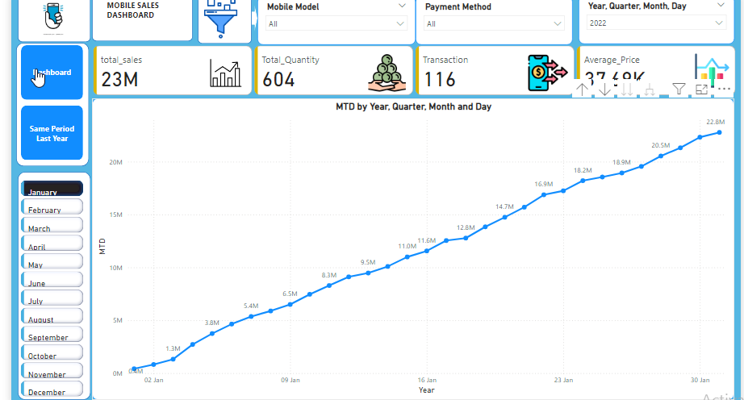

# 📱 Mobile Sales Dashboard – Power BI

📊 A Power BI project focused on analyzing mobile sales performance across cities, models, payment methods, and timeframes using interactive dashboards.

---

## 🧠 Project Summary

This dashboard provides actionable insights into:

- 🏙️ **City-wise Sales** – Identify top-performing cities and regions  
- 📆 **Sales Trends** – Analyze sales over months, quarters, and years  
- 📦 **Product Performance** – Track quantity, transactions, and pricing per model  
- 💳 **Payment Method Usage** – Understand consumer payment preferences  
- 👥 **Customer Ratings** – Visualize ratings distribution by satisfaction  
- 🔄 **YoY Sales Comparison** – Compare current year vs same period last year  

---

## 🖼️ Dashboard Previews

### 🔹 Main Dashboard

- Regional sales by city  
- Monthly trends, brand-wise breakdown  
- Customer satisfaction ratings  
- Payment method pie chart  
- Model-wise sales analysis  

---

### 📈 MTD (Month-to-Date) Report

- Track cumulative sales growth within a selected month  
- Daily sales values across the month for detailed trend analysis  

---

### 📊 Same Period Last Year Comparison

- Compare current year vs same period last year  
- Breakdown by **year**, **quarter**, and **month**  

---

## 🧰 Tools & Technologies Used

- **Power BI** – Data visualization and interactive dashboards  
- **DAX** – Custom metrics and calculations  
- **Power Query** –
